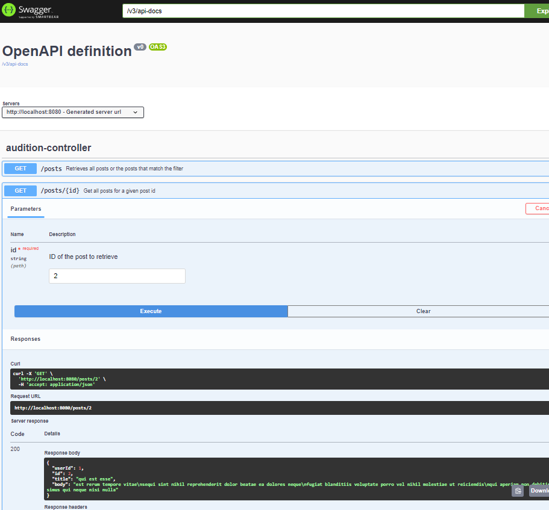
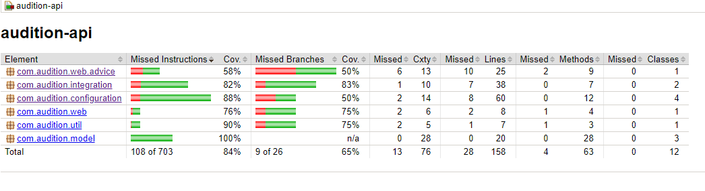

# Audition API

The purpose of this Spring Boot application is to test general knowledge of SpringBoot, Java, Gradle etc. It is created
for hiring needs of our company but can be used for other purposes.

## Overarching expectations & Assessment areas

<pre>
This is not a university test. 
This is meant to be used for job applications and MUST showcase your full skillset. 
<b>As such, PRODUCTION-READY code must be written and submitted. </b> 
</pre>

- clean, easy to understand code
- good code structures
- Proper code encapsulation
- unit tests with minimum 80% coverage.
- A Working application to be submitted.
- Observability. Does the application contain Logging, Tracing and Metrics instrumentation?
- Input validation.
- Proper error handling.
- Ability to use and configure rest template. We allow for half-setup object mapper and rest template
- Not all information in the Application is perfect. It is expected that a person would figure these out and correct.

## Getting Started

### Prerequisite tooling

- Any Springboot/Java IDE. Ideally IntelliJIdea.
- Java 17
- Gradle 8

### Prerequisite knowledge

- Java
- SpringBoot
- Gradle
- Junit

### Importing Google Java codestyle into INtelliJ

```
- Go to IntelliJ Settings
- Search for "Code Style"
- Click on the "Settings" icon next to the Scheme dropdown
- Choose "Import -> IntelliJ Idea code style XML
- Pick the file "google_java_code_style.xml" from root directory of the application
__Optional__
- Search for "Actions on Save"
    - Check "Reformat Code" and "Organise Imports"
```

---
**NOTE** -
It is highly recommended that the application be loaded and started up to avoid any issues.

---

## Audition Application information

This section provides information on the application and what the needs to be completed as part of the audition
application.

The audition consists of multiple TODO statements scattered throughout the codebase. The applicants are expected to:

- Complete all the TODO statements.
- Add unit tests where applicants believe it to be necessary.
- Make sure that all code quality check are completed.
- Gradle build completes sucessfully.
- Make sure the application if functional.

## Submission process

Applicants need to do the following to submit their work:

- Clone this repository
- Complete their work and zip up the working application.
- Applicants then need to send the ZIP archive to the email of the recruiting manager. This email be communicated to the
  applicant during the recruitment process.

  
---

## Additional Information based on the implementation

This section MUST be completed by applicants. It allows applicants to showcase their view on how an application
can/should be documented.
Applicants can choose to do this in a separate markdown file that needs to be included when the code is committed.

### Starting the application

Launch application with gradle from the root of the repository

```bash
gradlew.bat bootRun
```

### Contracts

Please navigate to the OpenAPI definition for the endpoinpts.
Documentation and manual testing of End points are available through the swagger documentation below:
[http://localhost:8080/swagger-ui/index.html](http://localhost:8080/swagger-ui/index.html)

These contracts are validated with a number of Junit tests



### Code coverage

Application was refactored to include code coverage checks
Below command runs the jacoco test coverage protocols and create reports

```bash
gradlew clean test jacocoTestReport
```



### Components testing.

The use of integration test and components testing can be done for the audition-api.  
These can be implemented as a separate gradle task. Integration tests can be run on their owne
in CI pipeline. 2 benefits this is include

1. CI completion cycle are shorter
2. Integration test can be run to detect regression when several engineers work on same services
3. Evaluating the behaviour of the application on different environments

One approach in the integration test improvements is to leverage 'Wiremock' servers and stubs
to further validate the application contracts

```java
@SpringBootTest
```

### Production readiness

Production readiness include aspect of Site Reliability Engineering, releasing and deployment

```java
@ActiveProfiles
```

## Improvements Backlog

### Optimisation & Performance

Below code perform two subsequent RestAPI calls. Although current data set is small,
A better performance improvement would be to treat both requests as non blocking.
It utilises the Flux and reactor libraries, reactive programming performance improvements
and hence the ability to created non blocking requests to thirds parti services

```java
AuditionPost post = getPostById(String.valueOf(postId));

// Fetch the comments for the post
List comments = restTemplate.getForObject(
    auditionAPIUrl + "/posts/" + postId + "/comments",
    List.class);
```

Non blocking request handling can be performed using WebClient. See below a better approach to calling two independent
api and combining the results

```java
 public Mono<AuditionPostComments> getPostWithComments(String postId) {
    return webClient.get()
        .uri("/posts/{postId}", postId)
        .retrieve()
        .bodyToMono(AuditionPost.class)
        .zipWith(webClient.get()
            .uri("/posts/{postId}/comments", postId)
            .retrieve()
            .bodyToMono(List.class))
        .map(tuple -> {
            AuditionPostComments postComment = new AuditionPostComments();
            postComment.setPost(tuple.getT1());
            postComment.setComments(tuple.getT2());
            return postComment;
        })
        .onErrorResume(e -> Mono.error(curatedServerException(e)));
}
```

### Resiliency

As the API has external endpoint dependencies. Circuit Breaker and Retry mechanisms
will provide service the ability to recover from outage of downstream services.
Resilience4j will be used.

### DevOps and Team Agility

CI/CD pipeline on Cloud provider will support incremental delivery of audition-api.
Feedback to the Agile team can arrive early, enhancing both delivery velocity and quality by keeping tests active and
enabling scans of libraries and components.

```yaml
steps:
  # Build unit tests only for faster performance and feedback
  - name: gradle:8-jdk17
    entrypoint: gradle
    args: [ "test" ]
    id: "unit_test_step"

  # Package the application and dependencies as a jar file
  - name: gradle:8-jdk17
    entrypoint: gradle
    id: "package_gradle"
    args: [ "assemble" ]

  # Build with integration tests only for faster performance and feedback
  - name: gradle:8-jdk17
    entrypoint: gradle
    args: [ "build", "-x", "integrationTest" ]
    id: "build_step"
    waitFor: [ "unit_test_step" ]  # This step waits for unit_test_step to complete


  - name: gradle:8-jdk17
    entrypoint: gradle
    args: [ "build", "integrationTest" ]
    id: "integration_test_step"
    waitFor: [ "build_step" ]  # This step waits for build_step to complete

  # Build the Docker image using the jar file created from the previous steps
  - name: gcr.io/cloud-builders/docker
    args: [ 'build', '-t', 'australia-southeast1-docker.pkg.dev/$PROJECT_ID/$REPO_NAME/weather-api:$SHORT_SHA', '--build-arg=JAR_FILE=build/libs/weather-api-1.0.0.jar', '.' ]
    timeout: 600s
    id: "build_image"
    waitFor: [ 'integration_test_step' ]  # This step waits for integration_test_step to complete

  # Push the Docker image to the artifact repository
  - name: 'gcr.io/cloud-builders/docker'
    args: [ 'push', 'australia-southeast1-docker.pkg.dev/$PROJECT_ID/$REPO_NAME/weather-api:$SHORT_SHA' ]
    waitFor: [ 'build_image' ]  # This step waits for integration_test_step to complete
    id: "artifactory_push"

  # Deploy image from Container Registry to Cloud Run
  - name: 'gcr.io/cloud-builders/gcloud'
    args:
      - 'run'
      - 'deploy'
      - 'full-stack'
      - '--image'
      - 'australia-southeast1-docker.pkg.dev/$PROJECT_ID/$REPO_NAME/weather-api:$SHORT_SHA'
      - '--region'
      - 'australia-southeast1'
      - '--platform'
      - 'managed'
      - '--port'
      - '8080'
      - '--allow-unauthenticated'
    waitFor: [ 'artifactory_push' ]  # This step waits for integration_test_step to complete

timeout: 5000s
options:
  logging: CLOUD_LOGGING_ONLY

```

### SRE touch points

#### Alter

Based on logs formats and exception handling alerts will be triggered to Service Product owners
Alerting will include Sevice Name, Time of events and Error messages and codes

#### Tracing

Span Id and Trace Id are provided here to ensure traceability in the context of decoupled architecture
Microservices

#### Monitoring

Metrics and monitory are done using collectors following the OpenTelemetry specification.
This application uses basic Logging Exporter for validation purposes.
This can be configured to changed to Cloudtrace exporters

We use authomatic instrumentation telemetry to infer the least code changes.

https://cloud.google.com/trace/docs/setup/java-ot#config-agent


